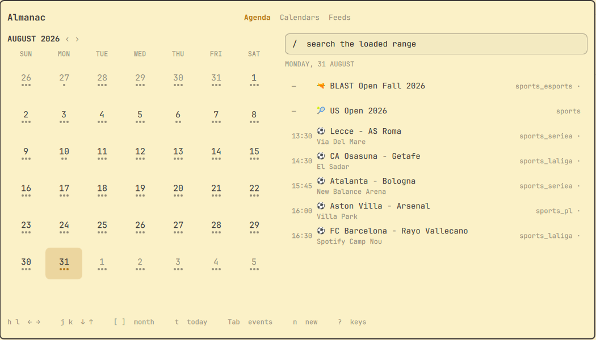
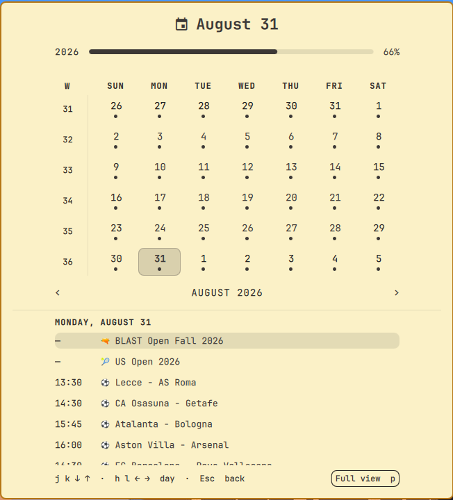

# Almanac

Almanac is a native Omarchy plugin for reading and managing a `khal` calendar.
It provides a bar widget with a month popup and a full overlay panel with
keyboard navigation, event creation and editing, calendar filters, and `.ics`
feed management.

## Requirements

- Omarchy with Quickshell plugin support
- `khal`, `jq`, `python3` with `icalendar` (a `khal` dependency)
- `vdirsyncer`, for feeds

Calendars come from `~/.config/khal/config`. Almanac never invents its own
store: whatever `khal` already reads is what shows up.

## Installation

```bash
omarchy plugin add https://github.com/harbefas/omarchy-almanac.git
omarchy bar put harbefas.almanac --section center
```

Installing with `--enable` breaks `bar put`, so the two steps stay separate.

The plugin can also be installed from a local checkout:

```bash
omarchy plugin add /path/to/omarchy-almanac
```

To open the full panel from anywhere, add this optional binding to
`~/.config/hypr/bindings.lua`:

```lua
o.bind("SUPER + ALT + C", "Almanac", "omarchy shell -q harbefas.almanac.manager toggle")
```

Then reload the shell:

```bash
omarchy restart shell
```

## Removal

```bash
omarchy plugin remove harbefas.almanac
```

The bar widget goes with it.

Almanac stores nothing of its own. Your calendars, `khal`'s config and
vdirsyncer's config are untouched by removal, including any feed added through
the panel, which stays configured and keeps syncing. Two things are yours to
undo if you set them up: the optional Hyprland binding above, and
`~/.config/omarchy/khal-filters.json` if you wrote one.

## Usage

### Bar popup

The widget shows the date. Clicking it opens the month.

| Key | Action |
| --- | --- |
| `h` `l` | Previous / next day |
| `j` `k` | Previous / next week |
| `[` `]` | Previous / next month |
| `{` `}` | Previous / next year |
| `Enter` | Step into the day's events, where `j` `k` walk them |
| `Esc` | Back to the grid, then close |
| `t` | Today |
| `w` | Toggle the first day of the week |
| `p` | Open the full panel on the selected day |

### Full panel

| Key | Action |
| --- | --- |
| `h` `l` | Previous / next day |
| `j` `k` | Previous / next week, or previous / next event in the list |
| `[` `]` | Previous / next month |
| `t` | Today |
| `Tab` | Move between the grid and the day's events |
| `n` | New event |
| `e` | Edit the selected event |
| `d` | Delete the selected event, after a confirmation |
| `Enter` | Edit, when the cursor is in the day's events |
| `/` | Search the loaded range |
| `a` `c` `f` | Agenda, Calendars, Feeds |
| `?` | Show the shortcut overlay |
| `Esc` | Close |

Selecting an event shows its detail below the list: the times, the calendar,
the location, and the description. A description is otherwise unreachable for
a readonly calendar, which has no edit form to open.

The form's calendar field moves the event: filesystem calendars are
directories, so changing it moves the file and the event keeps its UID. A
readonly or unknown target is refused.

The new-event form takes a repeat rule (`daily`, `weekly`, `monthly`,
`yearly`). Leaving the time off both ends creates an all-day event. Editing
does not offer the repeat field: an edit rewrites one VEVENT and has no
business rewriting a recurrence rule. Deleting a repeating event removes every
occurrence, since one file holds the whole series, and the confirmation says
so.

On the Calendars page, `Space` hides a calendar from the agenda. It keeps
syncing; this is a view filter, not a subscription change.

On the Feeds page, `n` adds a feed, `s` syncs the selected one, `Shift+S`
syncs every feed, and `d` removes one. Feed names are limited to one
section-safe token: letters, numbers, dashes and underscores. Feed URLs must be
`http://` or `https://`.

## When something is wrong

A read that fails is not an empty calendar, and the panel does not pretend
otherwise: it says which dependency is missing, or which config it could not
read, where the events would have been. `khal`, `jq` and `python3` with
`icalendar` all have to be installed for the plugin to have anything to show.

## Advertising in feeds

Some publishers staple a promo trailer onto the description of every event
they publish. The fixtur.es feeds append a "Calendar not up to date?" line and
a Buy Me a Coffee link, which for a fixture is the entire description, so it
filled the detail panel on every match. `khal-events` cuts it. The `.ics` on
disk is untouched and comes back whole on the next sync.

## How it talks to khal

Everything goes through the scripts in `bin/`, so the whole data layer can be
exercised from a terminal without opening the panel:

| Script | Purpose |
| --- | --- |
| `khal-calendars` | Calendars with their `readonly` flag, which `khal printcalendars` does not report |
| `khal-events` | Events for a date range, as JSON |
| `khal-event-new` | Create an event, refusing readonly calendars |
| `khal-event-edit` | Edit or delete an event by UID |
| `khal-feeds` | List, add, remove and sync `.ics` feeds |

The feed list carries two timestamps, because they answer different
questions: `synced` is when vdirsyncer last ran the pair, and `changed` is
when the events themselves last moved. A feed whose publisher went quiet
keeps syncing happily forever, so only the second one tells them apart.

Creation goes through `khal new`. Editing and deletion do not: `khal edit` is
interactive-only, with no flag for either, so they act on the `.ics` file
directly — filesystem calendars keep one file per event, and `khal` reindexes
from mtime. The file is located by reading UIDs rather than trusting the
filename.

Adding a feed writes both configs, the `vdirsyncer` pair and the `khal`
calendar, because either one alone leaves `khal` pointing at a directory
nothing syncs. Both are edited as text so their comments survive. Feed names,
URLs and colors are validated before either config is opened for append. Both
config files must already exist; Almanac does not create a new `khal` or
vdirsyncer setup from scratch.

Removing a feed unregisters it from both configs but leaves the events it
already downloaded on disk. `path` in those configs is yours to set and can
point anywhere, so removal does not recurse into it; the result says where the
leftovers are.

## Filtering noisy feeds

Some feeds are far too busy to read: a league feed can be fifteen events a
day. `~/.config/omarchy/khal-filters.json` keeps only the events whose title
matches, per calendar:

```json
{ "sports_mlb": "STL" }
```

## Tests

```bash
./test/run
```

Two suites, neither of which needs a calendar or a running shell:

- `test/khal-test.js` covers `Khal.js`, which is deliberately Qt-free so the
  parsing, sanitising, grouping and search rules can be checked under `node`.
- `test/bin-test.sh` runs the helpers against fixture configs with `khal`
  replaced by a stub, which is what makes the per-day flattening, the promo
  stripping and the feed round-trip checkable anywhere.

## License

MIT

## Previews




